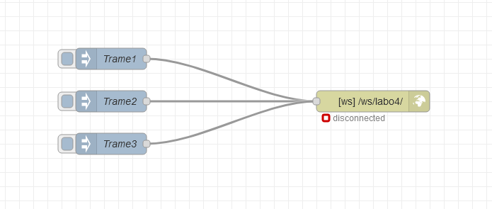

<h1>Labo4 (WebSocket, API serveur + Class) </h1>

<h2>Comment utiliser le laboratoire </h2>

- Aller sur Node-red ajouter 3 "Insert" et 1 "http respond"
- Dans le "http respond" mettre le type à "Listen on" et le "Path" à "/ws/lab04/"
- Dans les "Insert" mettre les 3 trames complete de test que le professeur nous a donnée comme ceci 
- Le Node-red devrais ressembler a ceci 
- Démarrer le programme main.py
- Retourner sur Node-red et appuyer sur les 3 "Insert"
- le WebSocket va se déconnecter et vous pouvez aller voir l'API sur l'adresse : http://127.0.0.1:8000/ 
- Ouvrer SQLiteStudio
- ajouter une Base de donnée qui s'appel "SQLlabo2.db" dans l'application et aller voir les données reçu

